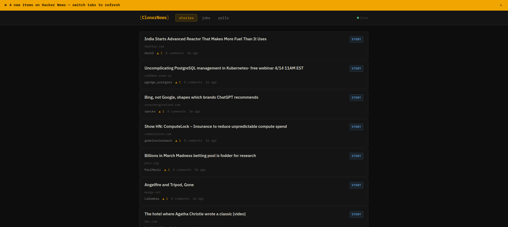

# 📰 ClonerNews

A minimal Hacker News client built with **vanilla JavaScript**, focused on performance, clean architecture, and real-time updates.



---

## ✨ Features

- ♾️ Infinite scrolling (IntersectionObserver)
- ⚡ Live updates via `/maxitem` polling
- 🧠 In-memory caching (TTL-based)
- 🧵 Post detail + comments view
- 📊 Poll support (via Algolia API)
- 🎨 Clean, responsive dark UI

---

## 🏗️ Architecture

```text
api.js   → data fetching & caching
ui.js    → DOM rendering
app.js   → state + app logic
```

- Clear separation of concerns
- No frameworks — pure JavaScript

---

## 🚀 Run locally

```bash
git clone https://github.com/your-username/clonernews.git
cd clonernews
```

### Option 1 (Node)

```bash
npx serve .
```

### Option 2 (Python)

```bash
python3 -m http.server
```

---

## 💡 Notes

- Uses Hacker News Firebase API + Algolia (for polls)
- Designed to feel like a real product, not just a demo

---

## 📌 Why this project

- Real-world API handling
- Performance patterns (caching, batching)
- Clean frontend architecture without frameworks
